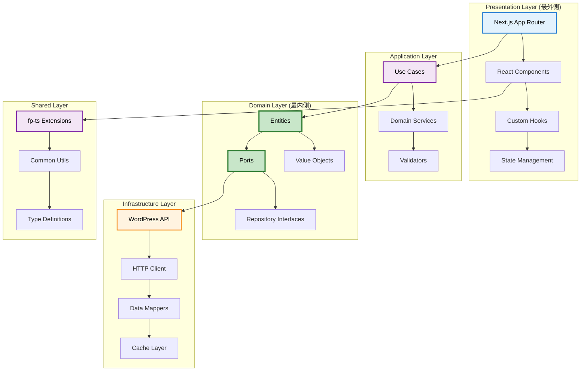
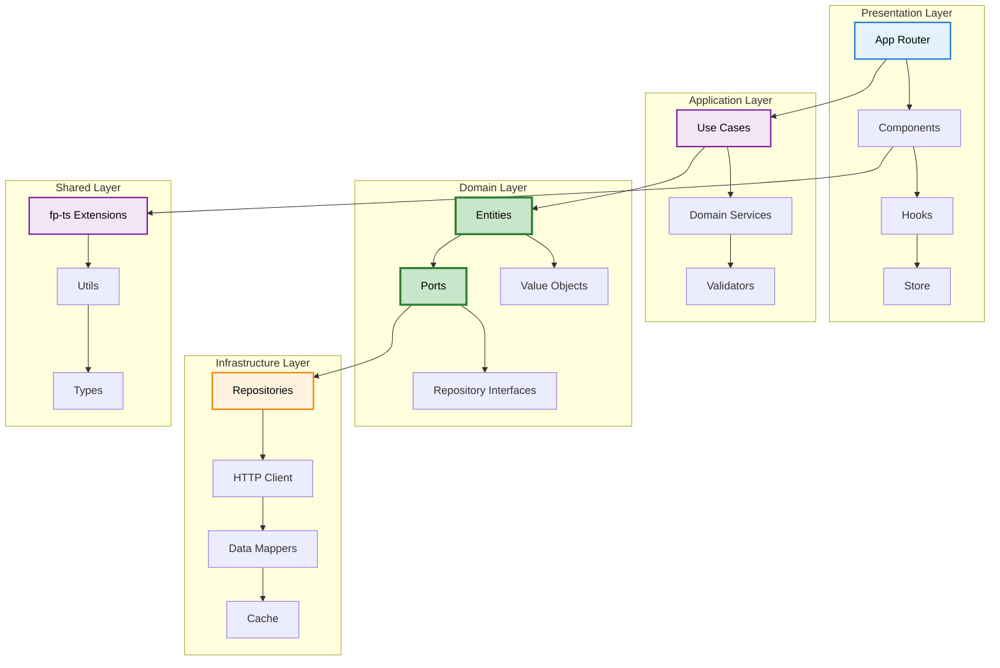
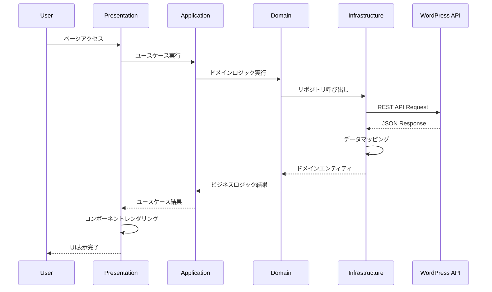

# ポートフォリオブログサイト実装計画書

## TODO
- アプリケーション層(`src/application`)の各モジュールについて説明してもらう

## 注意事項

### 実績機能の実装中断について

工数削減のため、実績機能の実装を削除し中断しています。

**削除コミットハッシュ**: `57f40cff7de8556b9e2b152dbfa288e838d33ee0`

実績機能関連のコードは削除済みですが、実装計画書では中断状況を示すため、実績機能関連の完了マーク（✅）を❌に置き換えています。

## 概要
個人のスキルや実績をアピールできるポートフォリオブログサイトの構築。

## アーキテクチャ
- WordPress REST APIをCMSとして活用 (取得表示機能のみ実装、管理機能は不要)
- 保守性とテスタビリティの高いコードベースの構築
- モダンなUI/UXの提供
- 関数型ドメインモデリング
- クリーンアーキテクチャ
- bulletproof-react
- グラスモーフィズム
- Tailwindを活用したデザインシステム (タイポグラフィ、余白、色など)

## ページ構成
### 共通
- 1カラムレイアウト
- 追従ナビゲーションバー (グラスモーフィズム、角丸)
- フッター
- ダークモード対応
- レスポンシブ対応

###  トップページ (`/`)
- ヒーロー
- 自己紹介ページへのリンク
- ブログ一覧ページへのリンク
- 最新記事3件

### 記事一覧 (`/blog`)
- タグ一覧 (よく使われる10件を1行表示)
- 3カラムの記事カード
- ページネーション
- 記事カードクリックで`Shared Element Transition`効果で記事詳細にアニメーションしながら遷移

### 記事詳細 (`/blog/[slug]`)
- アイキャッチ画像
- タイトル
- 投稿日
- 更新日
- タグ
- 要約
- 本文
- Zenn風TOC
- コードのシンタックスハイライト（行番号、選択行ハイライト、コピーボタン付き）
- 共有ボタン
- 関連記事

### タグ一覧 (`/tags`)
- タグをタグクラウド風（テキストサイズは均一）にシンプルに表示

### タグ詳細 (`/tags/[slug]`)
- 選択されたタグが設定されている記事を一覧表示する (基本的なUIは`記事詳細`と同じ)

### 自己紹介 (`/about`)
- Webアプリケーション開発者としての私の自己紹介
- 勤務先会社名
- 技術スタック
- 得意なこと
- 実績一覧ページへのリンク

### 実績一覧 (`/works`)
- 開発にかかわったプロジェクト、サービスなどを一覧表示
- 基本的なUIは`記事詳一覧`と同じ

### 実績詳細 (`/works/[slug]`)
- 基本的なUIは`記事詳細`と同じ

## 技術スタック
- **Frontend**: Next.js 16 + React 19 + TypeScript
- **Styling**: Tailwind CSS 4
- **Font**: Noto Sans JP（Next.js Font Optimization）
- **CMS**: WordPress REST API
- **FP Library**: fp-ts
- **UI Components**: shadcn/ui
- **Icons**: lucide-react
- **Theme**: next-themes
- **Animation**: framer-motion
- **State Management**: zustand
- **Data Fetching**: @tanstack/react-query
- **Validation**: zod
- **DI Container**: tsyringe, reflect-metadata
- **Search**: flexsearch
- **Date**: date-fns
- **Analytics**: GA4 (@next/third-parties)
- **Dev Tools**: ESLint, Prettier

## ディレクトリ構成

**注意**: テストファイルは各ディレクトリ内の`__tests__`ディレクトリに配置します。

```
app/
├── app/                           # Next.js App Router (Presentation層)
│   ├── blog/                      # ブログ機能のページ
│   │   ├── page.tsx              # 記事一覧ページ
│   │   ├── [slug]/page.tsx       # 記事詳細ページ
│   │   └── search/page.tsx        # 検索結果ページ
│   ├── works/                     # 実績機能のページ
│   │   ├── page.tsx              # 実績一覧ページ
│   │   └── [slug]/page.tsx       # 実績詳細ページ
│   ├── tags/                      # タグ機能のページ
│   │   ├── page.tsx              # タグ一覧ページ
│   │   └── [slug]/page.tsx       # タグ詳細ページ
│   ├── about/page.tsx            # 自己紹介ページ
│   ├── api/                       # API Routes
│   │   └── webhook/              # Webhook関連API
│   │       └── route.ts          # WordPress Webhook受信
│   ├── globals.css               # グローバルスタイル
│   ├── layout.tsx                # ルートレイアウト
│   ├── sitemap.ts                # サイトマップ生成
│   ├── robots.ts                 # robots.txt生成
│   └── not-found.tsx             # 404ページ
├── domain/                       # ドメイン層 (最内側)
│   ├── blog/                     # ブログドメイン
│   │   ├── entities.ts          # ブログエンティティ定義
│   │   └── ports.ts             # ブログポート定義
│   ├── works/                   # 実績ドメイン
│   │   ├── entities.ts          # 実績エンティティ定義
│   │   └── ports.ts             # 実績ポート定義
│   ├── tags/                    # タグドメイン
│   │   ├── entities.ts          # タグエンティティ定義
│   │   └── ports.ts             # タグポート定義
│   └── value-objects/           # 値オブジェクト（モジュール分割）
│       ├── index.ts            # 一括エクスポート
│       ├── post.ts             # 記事関連の値オブジェクト
│       ├── work.ts             # 実績関連の値オブジェクト
│       ├── tag.ts              # タグ関連の値オブジェクト
│       ├── common.ts           # 共通の値オブジェクト
│       └── validation.ts       # バリデーション関数
├── application/                  # アプリケーション層
│   ├── blog/                     # ブログ機能
│   │   ├── schemas.ts           # ブログ関連スキーマ
│   │   ├── validators.ts        # ブログ関連バリデーション
│   │   └── usecases.ts          # ブログ関連ユースケース
│   ├── works/                   # 実績機能
│   │   ├── schemas.ts           # 実績関連スキーマ
│   │   ├── validators.ts        # 実績関連バリデーション
│   │   └── usecases.ts          # 実績関連ユースケース
│   ├── tags/                    # タグ機能
│   │   ├── schemas.ts           # タグ関連スキーマ
│   │   ├── validators.ts        # タグ関連バリデーション
│   │   └── usecases.ts          # タグ関連ユースケース
│   ├── common/                  # 共通
│   │   └── errors.ts            # 共通エラー型
│   ├── services.ts              # ドメインサービス
│   └── di/                      # 依存性注入コンテナ
│       ├── usecases.ts          # 注入済みユースケース
│       └── di-container.ts      # DIコンテナ設定
├── infrastructure/               # インフラ層
│   ├── repositories/             # リポジトリ実装
│   │   ├── WpApiPostRepository.ts # WordPress記事リポジトリ
│   │   ├── WpApiWorkRepository.ts # WordPress実績リポジトリ
│   │   └── WpApiTagRepository.ts  # WordPressタグリポジトリ
│   ├── http/                     # HTTPクライアント
│   │   └── client.ts             # HTTPクライアント
│   ├── webhook/                  # Webhook関連
│   │   └── deploy.ts             # WordPress Webhook受信
│   ├── mappers/                # データマッパー
│   │   ├── wp-to-post.ts         # WordPress → Post変換
│   │   └── wp-to-work.ts         # WordPress → Work変換
│   ├── query/                     # React Query設定
│   │   ├── client.ts              # QueryClient設定
│   │   └── keys.ts                # Query Keys定義
│   ├── search/                    # 全文検索
│   │   ├── index.ts               # インデックス作成
│   │   └── adapter.ts             # FlexSearchアダプター
│   └── external/                 # 外部サービス
│       └── wordpress-api.ts      # WordPress API
├── presentation/                 # プレゼンテーション層
│   ├── components/               # UIコンポーネント
│   │   ├── ui/                   # 基本UIコンポーネント
│   │   │   ├── button.tsx        # ボタンコンポーネント
│   │   │   ├── card.tsx          # カードコンポーネント
│   │   │   ├── dialog.tsx        # ダイアログコンポーネント
│   │   │   ├── glass-card.tsx    # グラスモーフィズムカード
│   │   │   ├── pagination.tsx    # ページネーション
│   │   │   └── index.ts          # 一括エクスポート
│   │   ├── blog/                 # ブログ固有コンポーネント
│   │   │   ├── post-list.tsx      # 記事一覧
│   │   │   ├── post-detail.tsx   # 記事詳細
│   │   │   ├── post-card.tsx     # 記事カード
│   │   │   ├── share-buttons.tsx # 共有ボタン
│   │   │   └── toc.tsx          # 目次（Zenn風）
│   │   ├── works/                # 実績固有コンポーネント
│   │   │   ├── work-list.tsx     # 実績一覧
│   │   │   ├── work-detail.tsx   # 実績詳細
│   │   │   └── work-card.tsx     # 実績カード
│   │   └── common/               # 共通コンポーネント
│   │       ├── header.tsx         # ヘッダー
│   │       ├── footer.tsx        # フッター
│   │       ├── layout.tsx        # レイアウト
│   │       ├── search-modal.tsx   # 検索モーダル
│   │       ├── search-modal-trigger.tsx # 検索モーダルトリガー
│   │       ├── search-bar.tsx    # 検索バー
│   │       ├── search-result.tsx # 検索結果
│   │       ├── result-item.tsx   # 検索結果アイテム
│   │       ├── theme-toggle.tsx  # カラーモードスイッチャー
│   │       ├── transition-page.tsx # トランジションページ
│   │       └── analytics.tsx     # GA4コンポーネント
│   ├── hooks/                    # カスタムフック
│   │   ├── use-theme.ts          # テーマ管理
│   │   ├── use-intersection.ts   # スクロール監視
│   │   ├── use-local-storage.ts  # ローカルストレージ
│   │   ├── use-search.ts         # 検索機能
│   │   └── use-transition.ts     # トランジション管理
│   ├── utils/                    # プレゼンテーション層ユーティリティ
│   │   ├── task-either.ts        # TaskEither実行ヘルパー
│   │   ├── cn.ts                 # クラス名ユーティリティ
│   │   ├── format.ts             # フォーマット関数（日付など）
│   │   ├── seo.ts                # SEO関連
│   │   └── analytics.ts          # GA4ユーティリティ関数
│   └── store/                    # Zustand状態管理
│       ├── theme-store.ts        # テーマ状態
│       └── ui-store.ts           # UI状態
├── shared/                       # 共有ライブラリ
│   ├── fp-ts/                    # fp-ts拡張
│   │   ├── either.ts             # Either拡張
│   │   ├── task-either.ts        # TaskEither拡張
│   │   └── option.ts             # Option拡張
│   ├── utils/                    # 共通ユーティリティ
│   │   ├── format.ts             # フォーマット関数
│   │   ├── validation.ts         # バリデーション
│   │   └── date.ts               # 日付処理
│   ├── types/                    # 共通型定義
│   │   ├── common.ts             # 共通型
│   │   └── api.ts                # API型
│   └── constants/                # 定数
│       ├── api.ts                # API定数
│       ├── ui.ts                 # UI定数
│       ├── env.ts                # 環境変数
│       └── routes.ts             # ページルート定数
```

## アーキテクチャ図

### 全体アーキテクチャ図



### モジュール依存関係図



### データフロー図



## 実装計画

### ✅ [フェーズ1: 基盤構築](./phase1.md)
- **✅ フェーズ1.1**: プロジェクト初期設定
- **✅ フェーズ1.2**: ディレクトリ構成と型定義作成
- **✅ フェーズ1.3**: fp-ts拡張機能の実装
- **❌ フェーズ1.4**: 値オブジェクト（ブログ・実績・タグ関連）の実装（実績関連は削除済み）
- **✅ フェーズ1.5**: ドメインエンティティとポートの実装
- **✅ フェーズ1.6**: 共通ユーティリティ関数の実装
- **✅ フェーズ1.7**: shadcn/uiコンポーネントのセットアップ
- **✅ フェーズ1.8**: テーマシステムとカラーモード実装
- **✅ フェーズ1.9**: 基本レイアウト（Header/Footer）の実装
- **✅ フェーズ1.10**: ナビゲーション実装
- **⌛ フェーズ1.11**: レスポンシブ対応とモバイル最適化

### ✅ [フェーズ2: インフラ層実装](./phase2.md)
- **✅ フェーズ2.1**: HTTPクライアントの実装
- **✅ フェーズ2.2**: WordPress API連携の実装
- **✅ フェーズ2.3**: データマッパーの実装
- **❌ フェーズ2.4**: リポジトリ（ブログ、事績、タグ）の実装（実績関連は削除済み）
- **✅ フェーズ2.5**: React Query設定とQuery Keys定義
- **✅ フェーズ2.6**: エラーハンドリングとバリデーション実装
- **✅ フェーズ2.7**: オンデマンドISR対応

### ✅ [フェーズ3: アプリケーション層実装](./phase3.md)
- **✅ フェーズ3.1**: エラー型とバリデーション関数の実装
- **❌ フェーズ3.2**: Zodスキーマ定義（ブログ、実績、タグ）（実績関連は削除済み）
- **❌ フェーズ3.3**: ユースケース（ブログ、実績、タグ）の実装（実績関連は削除済み）
- **✅ フェーズ3.4**: ドメインサービスの実装
- **✅ フェーズ3.5**: DIコンテナ設定

### ✅ [フェーズ4: プレゼンテーション層実装（基本コンポーネント）](./phase4.md)
- **✅ フェーズ4.1**: UIコンポーネント（Button/Card/GlassCard）の実装
- **✅ フェーズ4.2**: UIコンポーネント（Pagination）の実装
- **✅ フェーズ4.3**: カスタムフック（useTheme、useIntersection、useLocalStorage）の実装
- **✅ フェーズ4.4**: Zustandストアの実装
- **✅ フェーズ4.5**: ユーティリティ関数の実装

### [フェーズ5: ブログ機能実装](./phase5.md)
- **✅ フェーズ5.1**: ブログAPIスキーマとバリデーション実装
- **✅ フェーズ5.2**: ブログ記事一覧ページの実装
- **✅ フェーズ5.3**: ブログ記事カードコンポーネントの実装
- **✅ フェーズ5.4**: ブログ記事詳細ページの実装
- **✅ フェーズ5.5**: コードのシンタックスハイライト機能の実装
- **フェーズ5.6**: TOC機能の実装
- **フェーズ5.7**: 共有ボタン機能の実装
- **✅ フェーズ5.8**: Shared Element Transitionの実装
- **フェーズ5.9**: タグ機能の実装
- **✅ フェーズ5.10**: オンデマンドISR対応

### ✅ [フェーズ6: 検索機能実装](./phase6.md)
- **✅ フェーズ6.1**: FlexSearchインデックス作成機能の実装
- **✅ フェーズ6.2**: 検索モーダルとSearchModalTriggerの実装
- **✅ フェーズ6.3**: SearchBarとSearchResultコンポーネントの実装
- **✅ フェーズ6.4**: リアルタイム検索機能の実装

### ❌ [フェーズ7: 実績機能実装](./phase7.md)（削除済み・中断中）
- **❌ フェーズ7.1**: 実績APIスキーマとバリデーション実装（削除済み）
- **❌ フェーズ7.2**: 実績一覧ページの実装（削除済み）
- **❌ フェーズ7.3**: 実績カードコンポーネントの実装（削除済み）
- **❌ フェーズ7.4**: 実績詳細ページの実装（削除済み）
- **❌ フェーズ7.5**: オンデマンドISR対応（削除済み）

### [フェーズ8: 自己紹介ページ実装](./phase8.md)
- **フェーズ8.1**: 自己紹介ページの実装
- **フェーズ8.2**: プロフィール情報の管理機能実装

### [フェーズ9: トップページ実装](./phase9.md)
- **フェーズ9.1**: トップページの基本実装
- **フェーズ9.2**: 最新記事5件の表示実装
- **フェーズ9.3**: オンデマンドISR対応

### [フェーズ10: 最適化とSEO実装](./phase10.md)
- **フェーズ10.1**: 画像最適化とコード分割の実装
- **フェーズ10.2**: React Queryキャッシュ戦略の実装
- **フェーズ10.3**: SEOメタタグと構造化データの実装
- **フェーズ10.4**: サイトマップとrobots.txtの実装

### [フェーズ11: アナリティクスと監視実装](./phase11.md)
- **フェーズ11.1**: GA4統合の実装
- **フェーズ11.2**: カスタムイベント追跡の実装
- **フェーズ11.3**: パフォーマンス監視の実装

### [フェーズ12: デプロイと自動化実装](./phase12.md)
- **フェーズ12.1**: GitHub Actions CI/CDパイプラインの実装
- **フェーズ12.2**: WordPress Webhook自動デプロイ機能の実装
- **フェーズ12.3**: 環境変数とシークレット管理の設定
- **フェーズ12.4**: 本番環境デプロイ設定

### [フェーズ13: テスト実装](./phase13.md)
- **フェーズ13.1**: ユニットテスト実装（ドメイン層）
- **フェーズ13.2**: ユニットテスト実装（アプリケーション層）
- **フェーズ13.3**: ユニットテスト実装（インフラ層）
- **フェーズ13.4**: コンポーネントテスト実装
- **フェーズ13.5**: E2Eテスト実装
- **フェーズ13.6**: テストカバレッジレポート生成